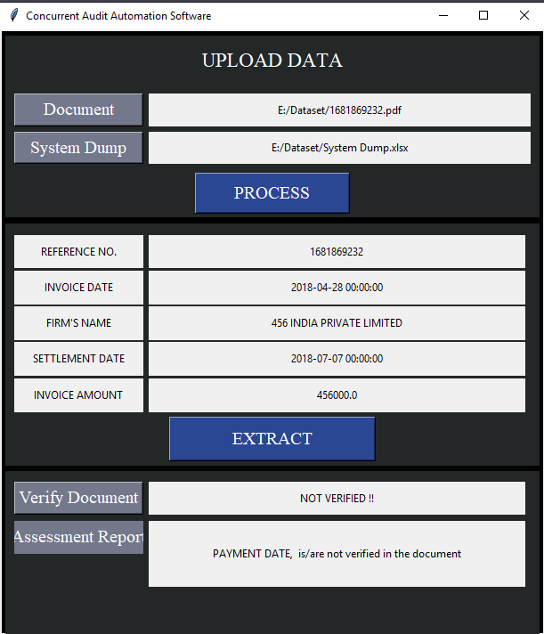

# Concurrent-Audit-Automation Application
## Introduction to problem statement

On a daily basis, foreign exchange (FX) transactions data is monitored for compliance with RBI regulations pertaining to confirmation of FX deal. This includes a number of FX deal attributes (e.g. Transaction Reference,  Counterparty Name, Deal Date, Value Date, Primary Currency, Counter Currency, Primary Currency Amount, Counter Currency Amount, etc.). 

On an average, transaction testers have to manually review:
1250-1500 underlying documents with 12-15 attributes in each underlying document resulting in physical verification of 15000-22500 data points.

## Proposed Solution
Therefore we have developed a transaction testing solution that can automate manual review by converting unstructured data in scanned “.pdf” files into structured data followed by comparison with the system generated deal listing.
We have used state of the art machine learning algorithms, natural language processing techniques and self developed algorithms that can automate the process of verification of documents and simultaneously creating an assessment report that summarizes the faults and anomalies encountered while verification.

## Libraries and dependencies
The proposed solution has been implemented using Python 3.7.1 and the following dependencies - 
* <b>Google Cloud Vision API </b> is an image analysis service that's part of Google Cloud Platform. It enables you to understand the content of images by encapsulating powerful machine learning models in an easy-to-use REST API. 
* <b>Tkinter</b> is a Python binding to the Tk GUI toolkit. It is the standard Python interface to the Tk GUI toolkit, and is Python's de facto standard GUI. 
* <b>Regular expressions</b> are a sequence of characters that define a search pattern. Usually such patterns are used by string searching algorithms for "find" or "find and replace" operations on strings, or for input validation.
* <b>Python Imaging Library</b> is a free library for the Python programming language that adds support for opening, manipulating, and saving many different image file formats. 
* <b>NumPy</b> is a library for the Python programming language, adding support for large, multi-dimensional arrays and matrices, along with a large collection of high-level mathematical functions to operate on these arrays.
* <b>Pandas</b> is a software library written for the Python programming language for data manipulation and analysis. In particular, it offers data structures and operations for manipulating numerical tables and time series.
* <b>Datetime</b> module supplies classes for manipulating dates and times in both simple and complex ways. While date and time arithmetic is supported, the focus of the implementation is on efficient attribute extraction for output formatting and manipulation.

## Repository Description
The repository consists of following files folders -
* <b>Notebooks</b>: The folder contains jupyter notebooks:
  - GUI: Graphical User Interface for automatic extraction and verification of document based on RBI guidilines. Also the conversion of unstructured data to structured format takes place which is furthered stored in excel format  
  
  - Concurrent Audit Automation: This notebook contains all the functions, algorithms and implementation of prototype with a detailed description
* <b>toolbox.py</b>: Contains all the functions and algorithms used in the prototype.
* <b>Dataset</b>: Contains sample document and processed document.

